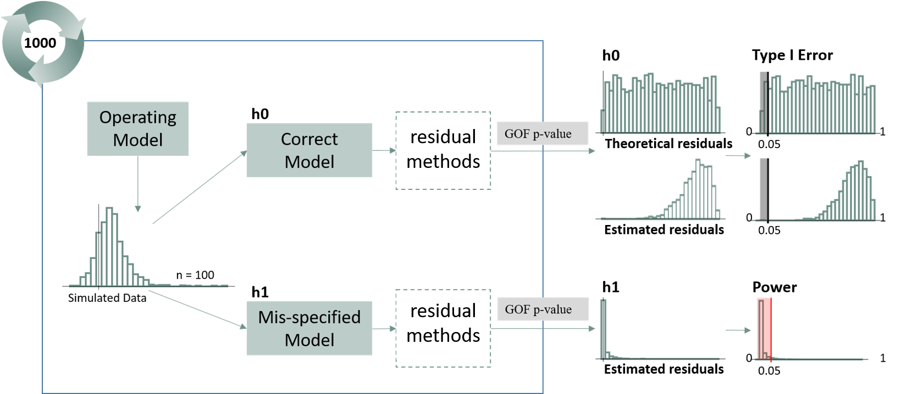

<br>

```{r, include = FALSE, warning = FALSE, message = FALSE }
source("../R/update-results.R")
#Set update = TRUE to update results from source code
update_results(update = FALSE)
source("../results/results-setup.R")
```


```{r quant-res, echo=FALSE, fig.height = 4, fig.cap="Fig. 1. Bottom left: Gamma distributed data, Gamma(alpha = 1, beta = 2) and a single observation (y = 1.758), indicated by the red line. Top left: The cdf value of the observation y given the distribution parameters. Top right: The same cdf value plotted on a standard normal cdf curve. Bottom right: The inverse cdf of the value is plotted on a standard normal distribution."}
knitr::include_graphics("figures/dgamma2dnorm.png")
```

<br>


```{r pears-quant-comp, echo = FALSE, results = "hide", warning = FALSE, message = FALSE, fig.height = 10, fig.cap = "Fig. 2. Pearson versus Quantile residuals for the correct model under four different scenarios (top to bottom): Approximately Normal Gamma, Skewed Gamma, Correlated Normal with rotated residuals, and Gamma with rotated residuals. "}
## IID =======================================================================
set.seed(1)
# Approx. normal gamma
y1 <- rgamma(1000, shape = 100, scale = .1)# mean=10; var=1
set.seed(2)
# Skewed gamma
y2 <- rgamma(1000, shape = .1, scale = sqrt(10))# mean =approx. .316; var = 1

# iid
out.y1 <- output.iid(y1)
out.y2 <- output.iid(y2)

## Banded Correlation========================================================
# Normal case
set.seed(1)
C <- exp(-as.matrix(dist(seq(0,10,length.out = 500))))
sig <- 3
S <- diag(rep(sig, ncol(C))) %*% C %*%  diag(rep(sig, ncol(C)))
eta <- as.numeric(rmvnorm(1, rep(0, ncol(C)), sigma=S)) 
y3 <- eta + 2

# Gamma case
set.seed(2)
alpha = .1
y4 <- rgamma( length(eta), shape = alpha, scale = exp(eta+2)/alpha )

#correlated
out.y3 <- output.mvn(y3, S, "normal")
out.y4 <- output.mvn(y4, C, "gamma")


p1 <- qqex.plot(y1, out.y1, "Approximately Normal Gamma")
p2 <- qqex.plot(y2, out.y2, "Skewed Gamma")
p3 <- qqex.plot(y3, out.y3, "Correlated Normal, Rotated")
p4 <- qqex.plot(y4, out.y4, "Correlated Gamma, Rotated")
grid.arrange(p1$h, p1$qq, 
             p2$h, p2$qq,
             p3$h, p3$qq,
             p4$h, p4$qq, ncol = 2)


```

<br>

```{r mvn-demo-1, echo = FALSE, fig.cap = "Fig. 3. Multivariate normal data from a 3x3 corvariance matrix. Off diagonal plots display correlation structure between each data column prior to (grey) and after (red) the decorrlation transformation. The blue arrow tracks points during the decorrelation step. All points move toward the center, indicating a scaling step. Not all points retain the same marginal percentage nor do they all end on the red spehere, demonstrating that a rotation is being applied in addition to the scaling."}
mvn.demo()
```

<br>

```{r studyoverview, echo=FALSE,  out.width = "100%", fig.cap = "Fig. 4. Overview of Simulation Study. Data were first simulated under the Operating (Correct Model). Data were then fit to two separate models: the same operating model and the mis-specified model. For each model fit, quantile residuals and subsequent GOF p-values were calculated for each method. This simulation was repeated 500 times and resulted in a distribution of p-values for each method under the correct and mis-specified model."}

```

<br>

# Extra Plots 

<br>

```{r chol-demo-1, echo=FALSE, out.width = "75%", fig.cap="Given zero-centered multivariate data with a covariance matrix, Sigma. Pairs plots visualize the correlation structure of the data. Blue and red indicate points tracked in transformation. The red points correspond with the marginal percentile in the histogram."}

knitr::include_graphics("figures/demo_pairs1.png")
```

<br>

```{r chol-demo-2, echo=FALSE, out.width = "75%", fig.cap="When observations are scaled to a unit variance, data are transformed to standardized normal space, yet correlation structure is retained."}

knitr::include_graphics("figures/demo_pairs2.png")
```

<br>
  
```{r chol-demo-3, echo=FALSE, out.width = "75%", fig.cap="In order to properly decorrelate the data, we need to apply a decoorelation method, such as the cholesky transformation. In this approach, we calculate the cholesky decomposition of the covariance matrix, Sigma, with which we use to transform the data to iid standardized normal space via both a scaling and a rotaion."}
knitr::include_graphics("figures/demo_pairs3.png")
```
